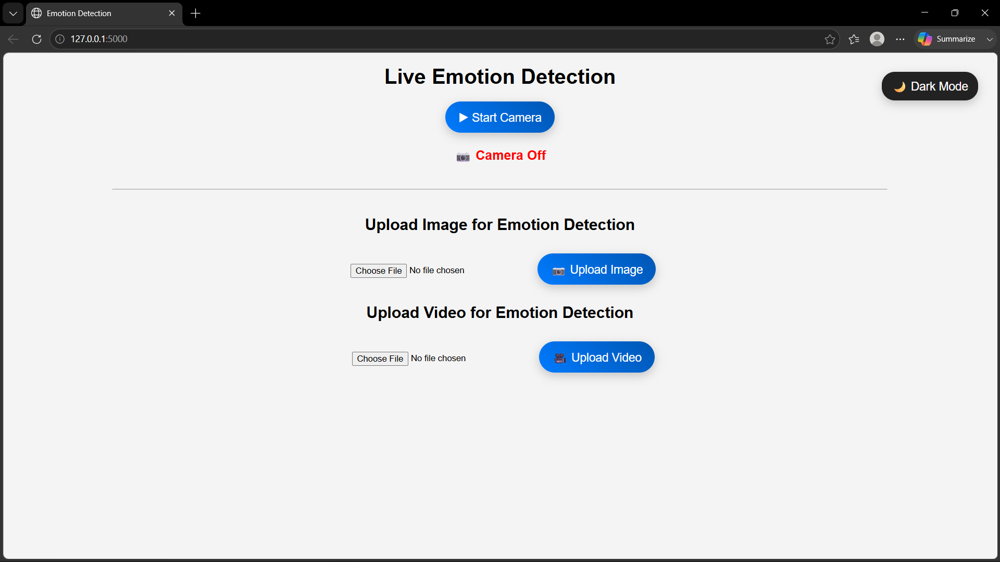
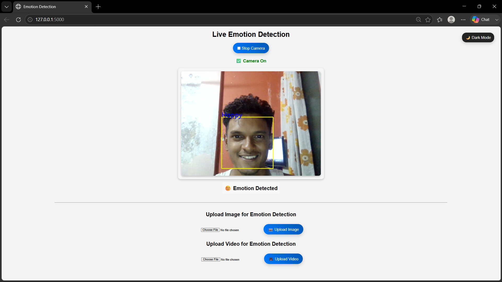

# 😊 Emotion Recognition Using Deep Learning

A real-time facial emotion recognition system that detects human emotions from live webcam feeds and uploaded images using Deep Learning.

---

## 📌 Overview

This project was developed as my Final Year Engineering Project. It uses a trained Deep Learning model to classify facial expressions into different emotions using OpenCV and TensorFlow/Keras.

---

## 🚀 Features

- 🎥 Real-time emotion detection using webcam
- 🖼️ Detect emotions from uploaded images
- 🧠 Deep Learning based prediction model
- 😊 Detects multiple facial expressions
- 🌐 Simple web interface
- 📊 Emotion prediction logging

---

## 🛠️ Tech Stack

- Python
- TensorFlow / Keras
- OpenCV
- HTML
- CSS
- JavaScript

---

## 📂 Project Structure

```
Emotion-Recognition-Deep-Learning
│
├── screenshots/
├── uploads/
├── web application/
│   ├── model/
│   ├── static/
│   ├── templates/
│   ├── uploads/
│   ├── Live_face.py
│   └── test_camera.py
```

---

## ⚙️ Installation

```bash
git clone https://github.com/SharmadB/Emotion-Recognition-Deep-Learning.git
```

Install dependencies

```bash
pip install -r requirements.txt
```

Run

```bash
python Live_face.py
```

---

## 📸 Screenshots

### Home Page



---

### Emotion Detection



---

## 🔮 Future Improvements

- Improve model accuracy
- Support multiple face detection
- Deploy on AWS
- Dockerize the application
- Build REST API

---

## 👨‍💻 Author

**Sharmad Bhandari**

GitHub: https://github.com/SharmadB